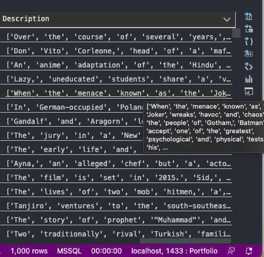
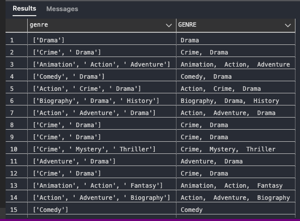
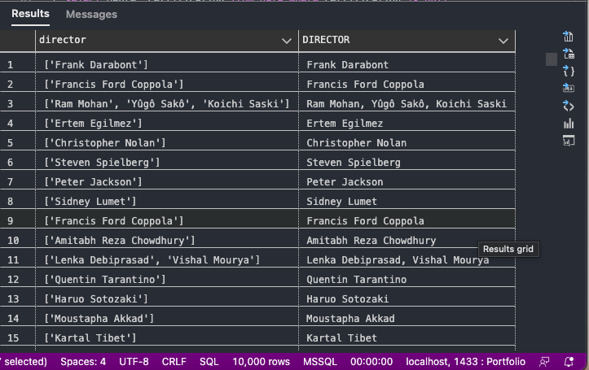
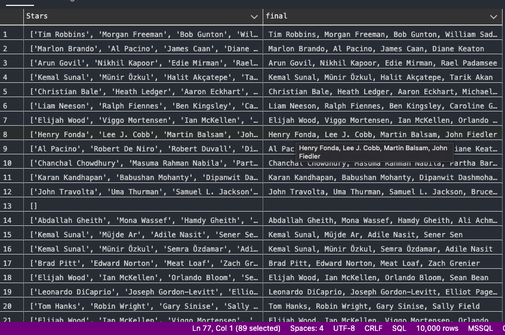
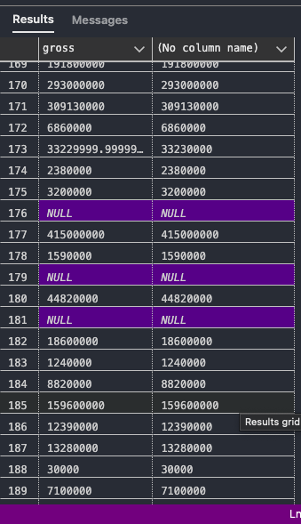
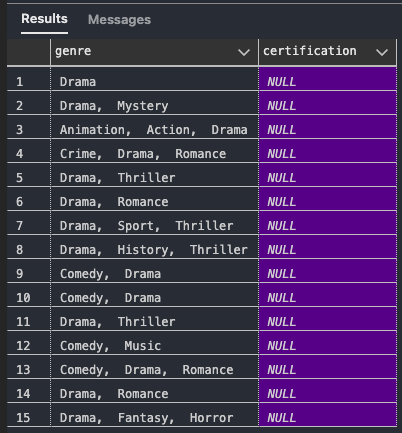
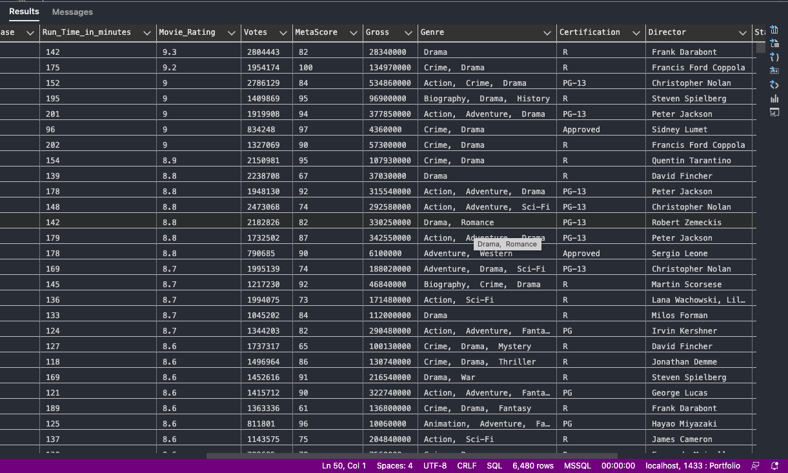

# SQL-Movies-1915-2023-cleaning

## INTRODUCTION

The purpose of this task is to use SQL to clean up movie data set of (1915 - 2023).The downloaded data needs to be imported into the microsoft sql data base before cleaning will start. The tools used in this cleaning are Microsoft SQL Studio and Azure data studio. Although each can be used independently to clean the data, but Azure data studio was also used due to some capabilities it has which MSSQL doesn'nt have.

The purpose of the cleaning are as follows

- Check for completeness ( data fields with values)
- Check for uniqueness (records that are duplicated)
- Check for consistency ( values free from contradiction)
- Check for accuracy (correct values)
- Check for Relevance
- Check for Uniqueness ( records that are duplicated )

## METHOD AND PROCEDURE

To clean up this data, first we needed to create a database called **PORTFOLIO**, then imported the data into the portfolio using Microsoft SQL server. The imported data can be worked on directly also in Azure data studio for Window users, or it can also be imported in Azure data studio for MAC users.

After running this SQL query to retrieve all the column data

    SELECT TOP (1000) [column1]
      ,[Movie_Name]
      ,[Year_of_Release]
      ,[Run_Time_in_minutes]
      ,[Movie_Rating]
      ,[Votes]
      ,[MetaScore]
      ,[Gross]
      ,[Genre]
      ,[Certification]
      ,[Director]
      ,[Stars]
      ,[Description]
    FROM [Portfolio].[dbo].[data]

The data seem to have the following errors
- The use of square brackets and quatation in the description, stars, genre and directors column
- Null values in metascore and gross column
- Null values in certification column that needs updating
- Rounding up values in gross column

**DROP DESCRIPTION COLUMN**

We will be dropping the description column because it will not be relevant in further analysis

This SQL query drops the **DESCRIPTION** column

  
    alter table data drop column description;
    select * from data;
  
**REMOVE BRACKETS AND QUOTATION ON DESCRIPTION IN GENRE COLUMN**

    select genre, replace(replace(replace(genre,'[',''),']',''),'''','') as GENRE from data;

--Update genre column with the corrected description

    update [data]
    set genre=replace(replace(replace(genre,'[',''),']',''),'''','')  from data;

**REMOVE BRACKETS AND QUOTATION FROM DIRECTORS COLUMN**

  This query removes brackets and quotation from Directors column

    select director, replace(replace(replace(director,'[',''),']',''),'''','') as DIRECTOR from data;

--Update directors column with correct description

    update [data]
    set director=replace(replace(replace(director,'[',''),']',''),'''','') from data;

**TO GET COUNT OF STARS FROM STARS NAME IN STARS COLUMN**

The purpose of this query is to get the number of stars featured in each movie from the name description in the star column. This number is relevant to analysis, than the names.First you run a query to get rid of brackets and quatation in the star column

    select Stars, replace(replace(replace(stars,'[',''),']',''),'''','') as final from data

**THEN UPDATE THE STAR COLUMN**

    update [data]
    set stars= replace(replace(replace(stars,'[',''),']',''),'''','')  from data

**THEN GET COUNT OF STARS**

    select stars, len(stars)-len (replace(replace(replace(replace(stars,'[',''),']',''),'''',''),',',''))+1 as count from data

  
**REMOVE NULL VALUES IN METASCORE AND GROSS COLUMN**

    delete from [data]
    where metascore is null or gross is null;

**ROUND UP VALUES IN GROSS COLUMN**

    select gross, round(gross,1) from data;

  
    update [data]
    set gross= round(gross,1) from data;

**ADD RATINGS TO NULL VALUES IN CERTIFICATION COLUMN BASED ON SIMILAR RATED GENRE FROM GENRE COLUMN**

  

    select distinct (genre),certification, count(genre) as occurence from [data]
    group by genre, certification;

    select genre, certification from data where certification is null;

  
    select certification, isnull(certification,'R') from [data]

    select genre,certification, isnull(certification,'R') from data WHERE genre 
    like 'Crime,  Drama,  Romance' or genre like 'Drama,  Romance'or genre 
    like 'Drama,  Thriller' or genre like 'Drama,  Fantasy,  Horror'
    or genre like 'Drama,  Mystery' or genre like 'Drama,  History,  Thriller'
    or genre like 'Drama  Sports,  Thriller' or genre like 'Comedy,  Drama,  Romance';

**UPDATE CERTIFICATION COLUMN**

    update [data]
    set certification= isnull(certification,'R') from data WHERE genre 
    like 'Crime,  Drama,  Romance' or genre like 'Drama,  Romance'or genre 
    like 'Drama,  Thriller' or genre like 'Drama,  Fantasy,  Horror'
    or genre like 'Drama,  Mystery' or genre like 'Drama,  History,  Thriller'
    or genre like 'Drama  Sports,  Thriller' or genre like 'Comedy,  Drama,  Romance';

    select genre, certification,isnull(certification,'PG-13')from [data]
    where genre like 'Animation,  Action,  Drama' or 
    genre like'Drama,  Sports,  Thriller' or genre like 'Comedy,  Drama'
    or genre like 'Comedy,  Music' or genre like 'Drama'
  
    update [data]
    set certification = isnull(certification,'PG-13')from [data]
    where genre like 'Animation,  Action,  Drama' or 
    genre like'Drama,  Sports,  Thriller' or genre like 'Comedy,  Drama'
    or genre like 'Comedy,  Music' or genre like 'Drama'

